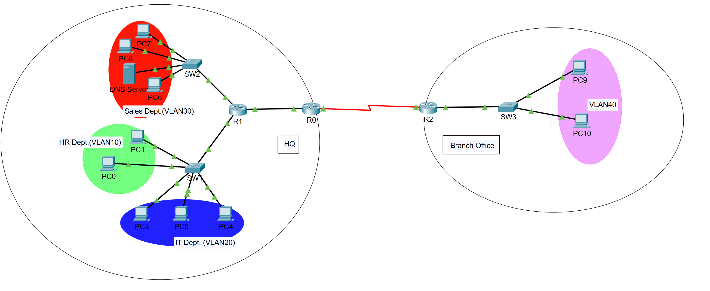

# Enterprise Multi-Site Network lab

## Overview

 Designed and implemented a multi-site enterprise network simulating real-world infrastructure with VLAN segmentation, dynamic routing and centralized services.

## Key Features
- VLAN Segmentation (10, 20, 30, 40)
- Inter-VLAN routing (Router-on-a-Stick)
- OSPF dynamic routing (HQ - Branch)
- DHCP with relay (ip helper-address)
- ACL Security (restricted VLAN communication)
- DNS + HTTP server integration

## Network Architecture
 - HQ Site
   - VLAN 10: Users
   - VLAN 20: Users
   - VLAN 30: Servers
 - Branch Site
   - VLAN 40: Remote Users
 
## Technologies Used
 - Cisco Packet Tracer
 - Routing: OSPF
 - Switching: VLANs, Trunking
 - Services: DHCP, DNS, HTTP
 - Security: ACLs

## Validation Tests
 - Inter-VLAN connectivity verified
 - OSPF routes propragated across sites
 - DHCP successfully assigns IPs to all VLANs
 - ACL blocks VLAN 10 ->  VLAN 20 traffic
 - DNS resolves app.local
 - HTTP server accessible from all VLANs

## Screenshots 

### Network Topology

### OSPF Routing

### Access-Lists

### DHCP

### DNS

### Successful Ping Test

### Blocked Ping Test

### Cross-Site-Test-Success
-cross-site-test-success.png)

### VLAN Structure

### Trunking

### Web Server

## Outcome

 Built and validated a full enterprise network demonstrating routing, switching, security and application-layer services.

## Files Included
 - Devices configurations (configs/)
 - Network topology
 - Validation Screenshots
